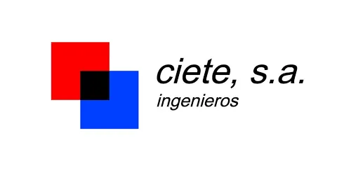

<p align="center">
  
</p>

<h1 align="center">ERP Ciete</h1>

<p align="center">
  Aplicación web de gestión interna para Ciete Ingenieros
</p>

<p align="center">
  
  
  
  
  
  
  
  
  
</p>

<p align="center">
  Proyecto desarrollado en el entorno de prácticas de Ábaco para la digitalización y control de procesos internos de Ciete Ingenieros.
</p>

---

## Descripción

ERP Ciete es una aplicación web orientada a centralizar, organizar y modernizar la gestión interna de la empresa, sustituyendo progresivamente procesos manuales y estructuras dispersas basadas en hojas Excel por una plataforma unificada, clara y escalable.

El objetivo del sistema es mejorar el control operativo, la trazabilidad de la información y la organización general de los distintos flujos de trabajo de la empresa.

---

## Objetivo del proyecto

Este proyecto busca construir una base sólida y profesional para la gestión interna de Ciete Ingenieros, permitiendo evolucionar hacia un entorno más eficiente, mantenible y preparado para futuras ampliaciones.

No se pretende únicamente trasladar datos a una aplicación web, sino diseñar una herramienta útil, bien estructurada y adaptada al flujo real de trabajo de la empresa.

---

## Tecnologías utilizadas

- **Laravel 12** como framework principal de backend
- **PHP 8.2** para la lógica del servidor
- **Blade** para el sistema de vistas
- **MySQL** como base de datos relacional
- **JavaScript** para interactividad en cliente
- **Vite** para compilación de assets
- **HTML5** y **CSS3** para estructura y estilos
- **Git / GitHub** para control de versiones y trabajo colaborativo

---

## Áreas funcionales previstas

La aplicación se plantea para dar soporte a bloques como:

- presupuestos
- líneas de presupuesto
- pedidos
- proyectos
- empresas y contactos
- legalizaciones
- usuarios
- control general de trabajos
- panel administrativo

---

## Estado actual

El repositorio contiene la base oficial de trabajo del proyecto ERP Ciete, sobre la que se irá construyendo progresivamente la aplicación web.

En esta fase se está consolidando:

- la estructura inicial del proyecto
- la arquitectura técnica base
- la organización del repositorio
- la preparación de módulos funcionales principales

---

## Instalación del proyecto

Clonar el repositorio:

```bash
git clone https://github.com/erp-abaco-ciete/erp-ciete.git
cd erp-ciete
```
